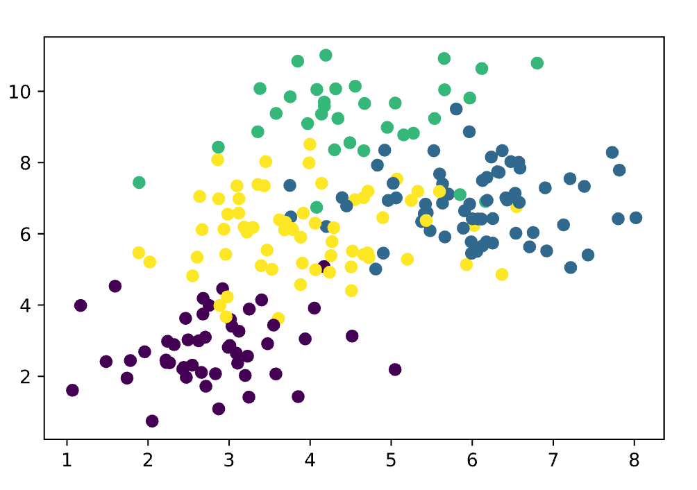
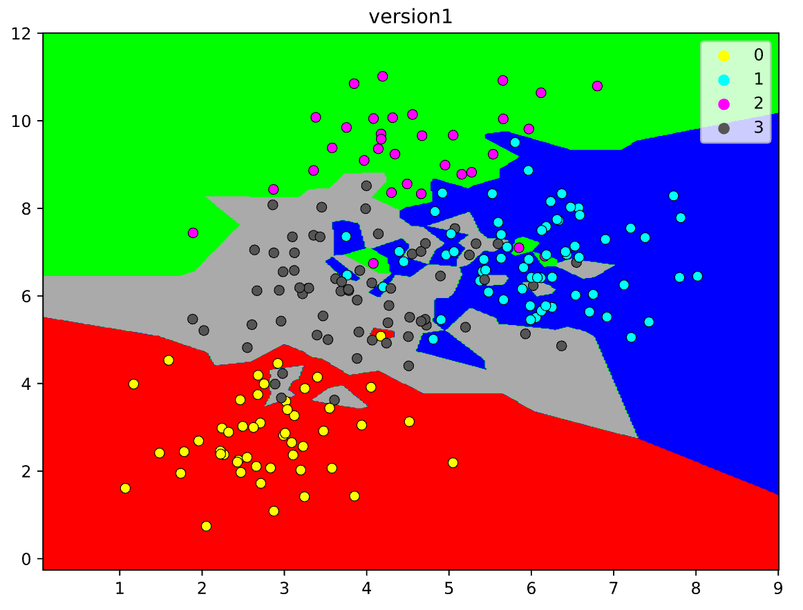
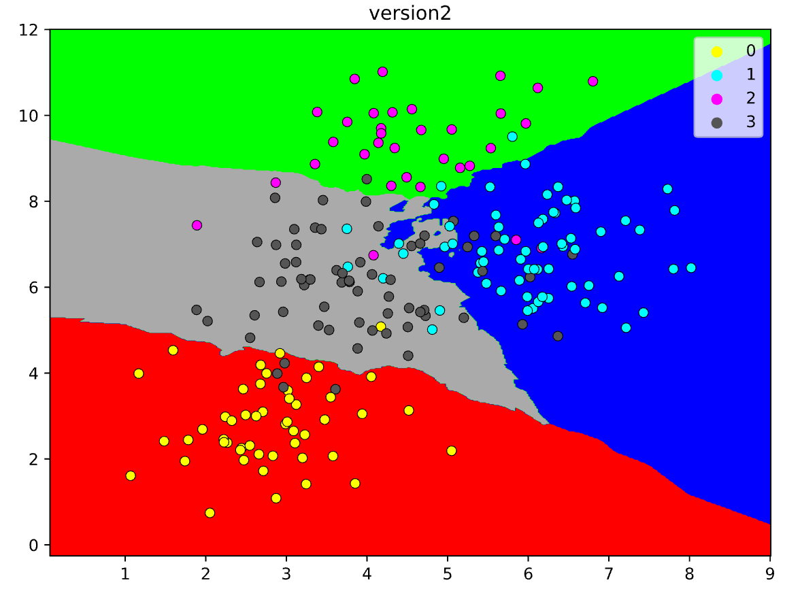
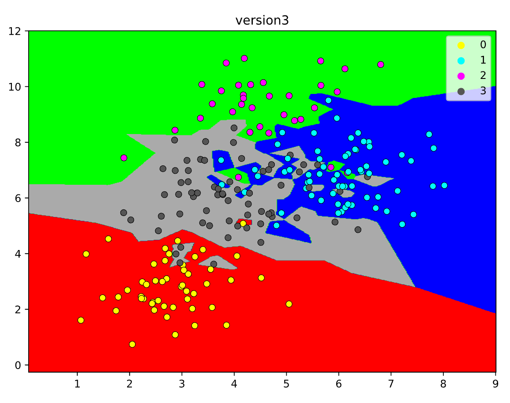
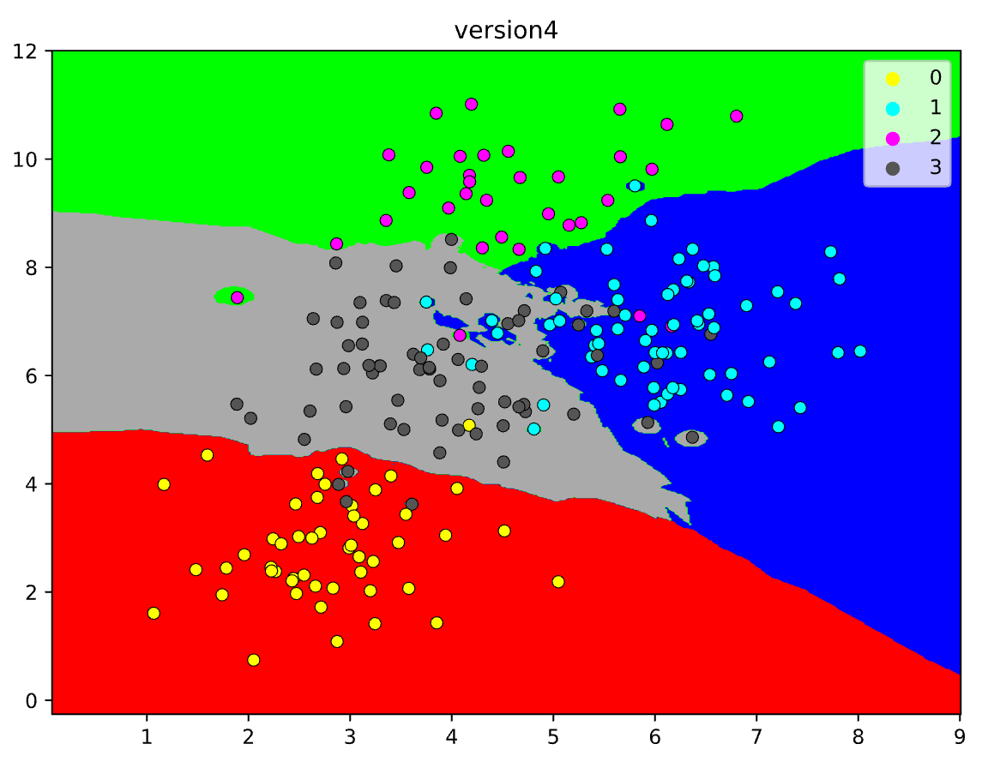

<h1 align=center>Raport z KNN</h1>
<h2 align=center>Stanisław Denkowski 305288</h2>

### Etap 1 - Dane
Wygenerowane dane, starałem się by spełniały wszystkie wymagania:

* są 4 klasy
* klasy są wymieszane i są róne wyspy wewnątrz innych klas
* gęstość obserwacji jest nierówna
* kształ całego zbioru jest nierówny

### Etap 2 - Zobaczmy przebieg granicy decyzyjnej

1. Wersja pierwsza:
    * k=1, głosowanie większościowe i metryka Euklidesa
    
    * k=13, głosowanie większościowe i metryka Euklidesa
    
    * k=1, głosowanie większościowe i metryka Mahalanobisa
    
    * k=9, głosowanie ważone odwrotnie do odległości i metryka Euklidesa
    

### Etap 3 - Ocena wairantów

* Wydaje mi się, że w naszym przypadku metryka Mahaalanobisa jest przekombinowana. Jasne jest, że k=1 będzie przeuczać (overfitting), pozostały więc dwie opcje. Podejrzewam, że głosowanie ważone odwrotnie do odległości ma więcej sensu, niż głosowanie większościow. Oznacza to, że **moim zdaniem najlepiej zadziała wersja czwarta**.

Testy(wszystkie testy wykonane na takich danych - 200 punktów, 10 powtórzeń w obu przypadkach gdy chcemy wyznaczyć średnią skuteczność):
1. Wersja pierwsza i druga (różnią się tylko k, które i tak jest zmienne w naszym badaniu) - Najlepsza średnia skuteczność 85%, odchylenie standardowe 5%, dla k=14.

2. Wersja trzecia  - Najlepsza średnia skuteczność 82%, odchylenie standardowe 3%, dla k=20

3. Wersja czwarta  - Najlepsza średnia skuteczność 75%, odchylenie standardowe 7%, dla k=5

**W praktyce najlepsza jest wersja druga (na testach pierwsza i druga się scaliły), co jest dla mnie bardzo zaskakujące wersja czwarta wypadła najgorzej.**

Odchylenia standardowe są mniej więcej o rząd wielkości mniejsze. od prawie 10% dla wersji 4, do około 4% dla wersji trzeciej.
