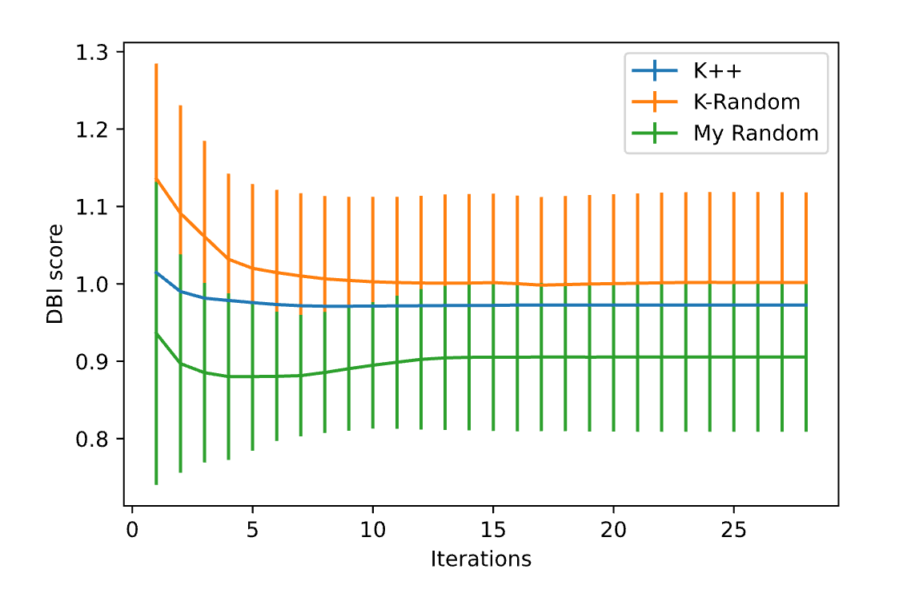
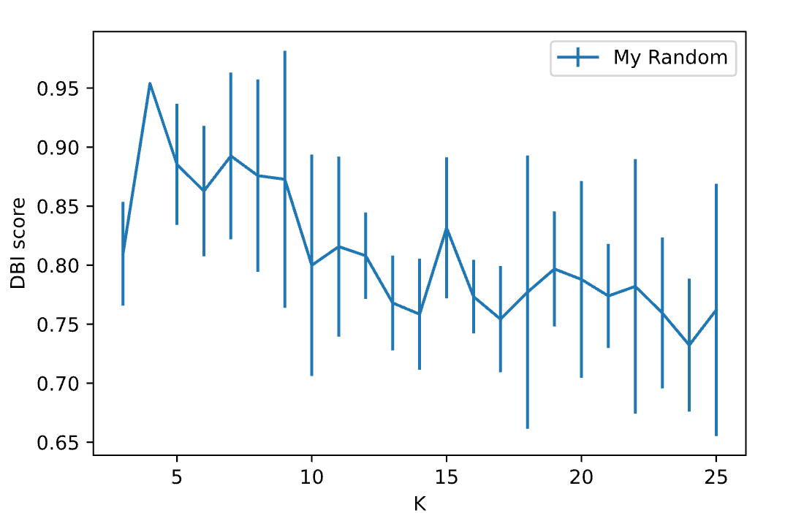
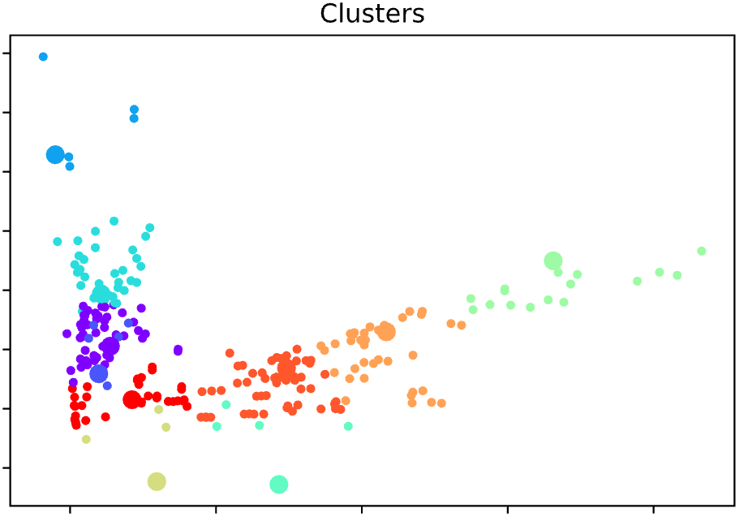
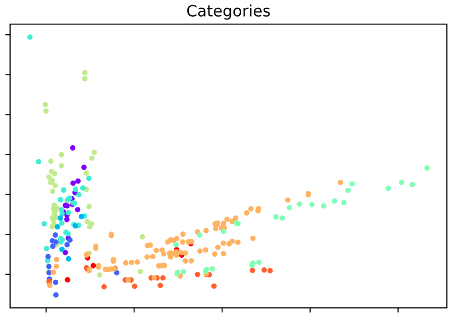

<h1 align=center>Raport z KMeans</h1>
<h2 align=center>Stanisław Denkowski 305288</h2>

### Etap pierwszy DANE

Mamy 9 następujących kategorii:
```
Chicken & Fish,
Salads,
Snacks & Sides,
Desserts,
Breakfast,
Coffee & Tea,
Smoothies & Shakes,
Beef & Pork,
Beverages
```

#### Nie wszystkie kolumny są potrzebne

```
Category                          object
Item                              object
Serving Size                      object
Calories                           int64
Calories from Fat                  int64
Total Fat                        float64
Total Fat (% Daily Value)          int64
Saturated Fat                    float64
Saturated Fat (% Daily Value)      int64
Trans Fat                        float64
Cholesterol                        int64
Cholesterol (% Daily Value)        int64
Sodium                             int64
Sodium (% Daily Value)             int64
Carbohydrates                      int64
Carbohydrates (% Daily Value)      int64
Dietary Fiber                      int64
Dietary Fiber (% Daily Value)      int64
Sugars                             int64
Protein                            int64
Vitamin A (% Daily Value)          int64
Vitamin C (% Daily Value)          int64
Calcium (% Daily Value)            int64
Iron (% Daily Value)               int64
```

Wartości liczbowe są ładnie reprezentowane, jedynie będziemy musieli je ewentualnie znormalizować.
Category i Item nie jest istotne, a serving size wykorzystamy do przeliczenia danych na jedną jednostkę, niezależnie od jej rodzaju.
Nie ma potrzeby doublować kolumny, jeśli podana jest % i nieprocentowa wartość - procentowa jest zazwyczaj sensowniejsza.
Dorośli powinni spoyżwać, przyjmijmy 2,250 kalorii dziennie - dzięki takiemu założeniu możemy wyznaczyć procentowe dzienne spożycie kalorii (pominiemy kalorie z tłuszczu).
Pominiemy Trans Fat, bo on zawiera się już w tłuszczach.
Przyjmiemy również 30 gramów cukrów jako, maksymalne zalecane dzienne spożycie.
Dodatkowo zakładamy, że dzienne spożycie białka powinno być mniej więcej 51 gramów.
Wszystkie te wartości są średnią z zalecanych wartości dla mężczyzn i kobiet.

Mamy zatem:

```
Calories (% Daily Value)         float64
Total Fat (% Daily Value)        float64
Saturated Fat (% Daily Value)    float64
Cholesterol (% Daily Value)      float64
Sodium (% Daily Value)           float64
Carbohydrates (% Daily Value)    float64
Dietary Fiber (% Daily Value)    float64
Sugars (% Daily Value)           float64
Protein (% Daily Value           float64
Vitamin A (% Daily Value)        float64
Vitamin C (% Daily Value)        float64
Calcium (% Daily Value)          float64
Iron (% Daily Value)             float64
```

W naszym przypadku, nie ma potrzeby centrować zbioru danych.
Nie będziemy normalizować danych bardziej, niż przedstawienie wszystkich danych jako procent zalecanego dziennego spożycia.


### Zadania

Wybrałem indeks Daviesa-Bouldina jako metrykę.
Metryka ta reprezentuje  "ścisłość/zbitość" (compactness) oraz "rozdzielność" (separablity) w jednej wartości - wybieramy środki tak aby zminimalizować maxa z sumy średniej odległości wierzchołków dwóch centrów, podzielonej przez odległość między tymi centrami.
Może to powowdować problemy, gdy nasze obserwacje mają bardziej nieregularne kształty(np. podłużne), równolegle i niedaleko od siebie. Innym przypadkiem, mogłoby być np. duże skupisko kilku cech niedaleko siebie i drugie rzadsze jednej cechy daleko - jedno gęste skupisko może zostać jedną cechą, a drugie rzadkie rozdzielone na killka małych.

#### Przyjmuję k=6



Jak widać, niespodziewanie najlepsze wyniki otrzymujemy dla napisanego ręcznie losowania z rozkładem jednostajnym, natępnie jest zaimplementowany KMeans++, a na końcu zaimplementowany K-Random.

#### Niestety nie wydaje się, by funkcja osiągała globalne minimum w rozsądnym zakresie



Jeśli się doszukiwać, zdecydowałbym się na k=10, ponieważ wydaje się to być rozsądne minimum - do tego momentu funkcja wydaje się sensownie maleć, później oscyluje w okolicy, z drobną tendencją malejącą. Dodatkowo, jest to liczba zbliżona do liczby obserwacji.

### Właściwe KMeans

Takie jest rozłożenie w obserwacji w klastrze:
```8: 66
7: 59
2: 56
4: 45
6: 16
1: 6
9: 6
0: 4
5: 1
3: 1
```

Jak widać, jest spora rozbieżność - 5 klastrów zawiera zdecydowaną większość obserwacji, reszta po prostu uzupełnia tak by zminimalizować score.
Nie ma to większego sensu dla człowieka.



Jak widać centra są w miarę nieźle dopasowane, do odpowiadających im klastrom.
Jeśli chodzi o klastry, gdyby się bardzo doszukiwać, dałoby się znaleźć sensowne dopasowanie, jednak bez porównania z kategoriami jest to trudne.



Jak widać, tak dobrane klastry nie mają praktycznie żadnego pokrycia z rzeczywistymi kategoriami. Mam nadzieję, że nie wynika to zmojego błędu.
